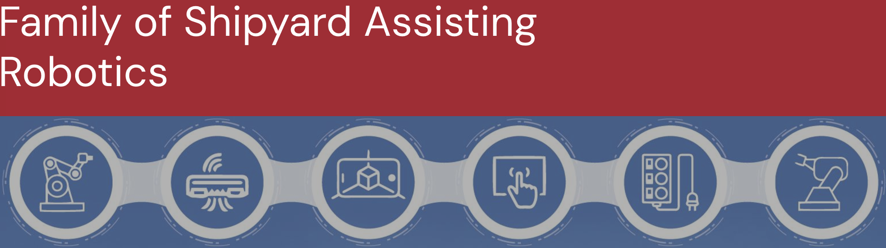

Welcome to the FOSAR Github Organization.

## Purpose
The Family of Sustainment Assisting Robotics (FOSAR) is a national response to addressing shipyard production and sustainment and maintenance needs. 

The goal of this organization is to focus on common foundational building blocks to enable novel new capabilities in a standard and common way. These resources will be provided by members of the organization and supported by the FOSAR support team. The intent is
to enable robotics solution providers to the shipbuilding and ship maintenance domain to have common tools that enable delivering of capable advanced robotics systems that are simpler to use, maintain and service over their service life.

Learn more about FOSAR and its purpose [here](https://www.boston-engineering.com/boston-engineering-wins-7-75m-contract-to-strengthen-the-nations-maritime-industrial-base/)

## Status of Repositories
•	The repositories included herein are intended to be common building blocks, or non-competitive tools and infrastructure to enable more commonality and sound foundation for shipyard and shipyard sustainment automated systems.  
•	Entities within the FOSAR ecosystem, and eventual Consortium, may make contributions to this organization, but the maintenance must be accounted for relative to the support bandwidth and with the approval of the FOSAR technical steering team.  
•	Issues and Pull Requests may be submitted by entities interested in these foundational tools and capabilities but approval and merging will only be done by FOSAR maintainers.  
•	The repositories to be included in the FOSAR GitHub organization will be maintained by FOSAR Organization maintainers.

## Inquiries into FOSAR Participation
If you and your organization are interested in learning more about FOSAR and potentially would like to join, please reach out! You can send inquiries at the [this](https://www.boston-engineering.com/contact/) link.